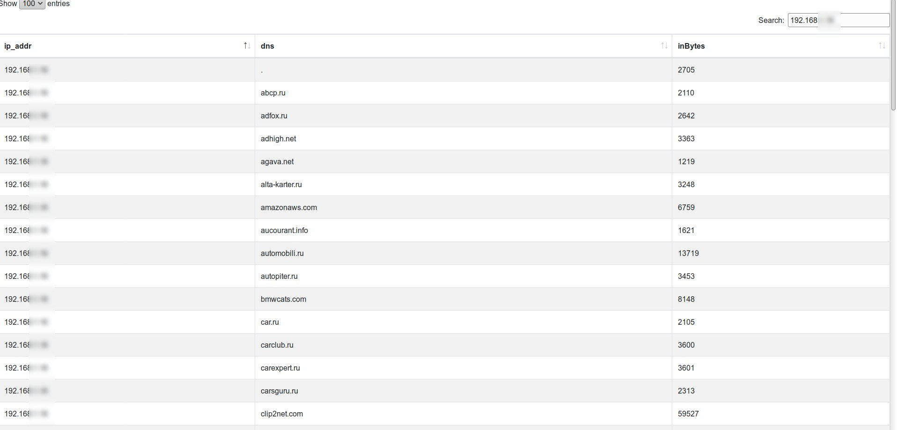

# NSLV: NtopNG Simple netflowLog Viewer
 
Simple utility, that connect to [ntopng](https://www.ntop.org/) collected flow and gather simple info. Ntopng use mysql  [RDBMS](https://www.ntop.org/guides/ntopng/advanced_features/flows_dump.html#mysql).  

Utility gather ip-addr for L7 protocols: HTTP(code `7L` or `L4_DST_PORT='80'`) and HTTPS (code `178` or `L4_DST_PORT='443' `) and resolve them into DNS names.
Then it puts data into `dns` COLUMN in the same table (you should create it by modifying existing table `flowsv4`)
```
alter table flowsv4 add column dns varchar(100);
```

For **backend** i use`flow2.php`: it  generates JSON data.  
For **frontend** i use `index.html`: it  outputs JSON with [DataTables](https://datatables.net/) with [Bootstrap4](https://getbootstrap.com/) ):    




### Please, dont forget change your creds!


License: MIT  

Author: [ep4sh](https://github.com/ep4sh)
